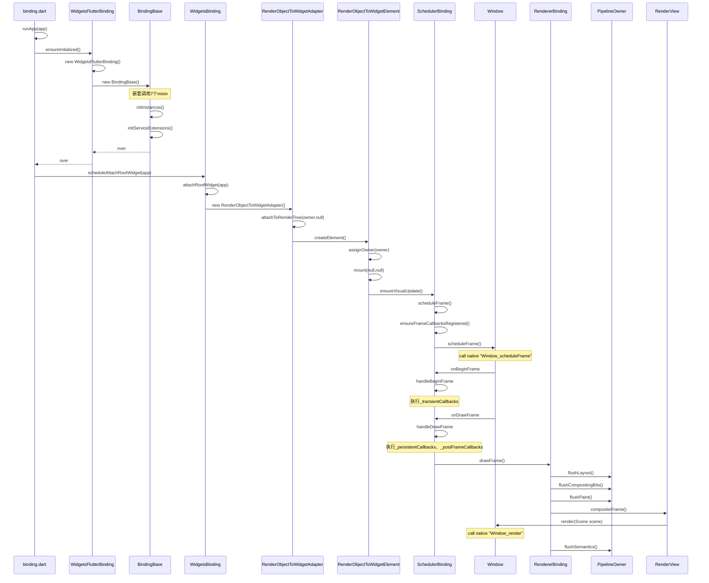

### 摘要
version: Channel dev, v1.18.0-8.0.pre

从源码角度来分析Flutter应用启动过程。

<!--more-->
### 由runApp引发的血案
[widgets/binding.dart]
```Dart
void runApp(Widget app) {
  WidgetsFlutterBinding.ensureInitialized()
    ..scheduleAttachRootWidget(app)
    ..scheduleWarmUpFrame();
}
```
- 三行代码解决一切，分别来分析每行代码都做了哪些事情。

#### `WidgetsFlutterBinding.ensureInitialized()`
[widgets/binding.dart#WidgetsFlutterBinding]
```Dart
class WidgetsFlutterBinding extends BindingBase with GestureBinding, ServicesBinding, SchedulerBinding, PaintingBinding, SemanticsBinding, RendererBinding, WidgetsBinding {
  static WidgetsBinding ensureInitialized() {
    if (WidgetsBinding.instance == null)
      WidgetsFlutterBinding();
    return WidgetsBinding.instance;
  }
}
```

- 说明：WidgetsFlutterBinding是绑定framework层和Flutter引擎层的胶水(glue)
- 查看BindingBase里面的代码可知，WidgetsFlutterBinding初始化的时候会调用initInstances方法，由于mixin的特性，所以会调用WidgetsBinding的initInstances方法，然而这个方法里面有`super.initInstances()`调用，这里就会调用上一层RendererBinding的initInstances方法，依次类推，所有Binding的initInstances方法都会被调用到。
- 接下来具体查看每个Binding的initInstances都做了哪些事情

##### `WidgetsBinding`：Flutter引擎层和Widget层之间胶水
[widgets/binding.dart#WidgetsBinding]
```Dart
  void initInstances() {
    // 注意这里的super调用，这里说明，下面代码的WidgetsBinding的操作都在上层initInstances方法执行完后
    super.initInstances(); 
    _instance = this;
    // BuildOwner是widgets框架的管理类
    _buildOwner = BuildOwner();
    // 设置BuildOwner的onBuildScheduled回调
    buildOwner.onBuildScheduled = _handleBuildScheduled;
    // 设置window的onLocalChanged回调
    window.onLocaleChanged = handleLocaleChanged;
    // 设置window的onAccessibilityFeaturesChanged回调
    window.onAccessibilityFeaturesChanged = handleAccessibilityFeaturesChanged;
    // 处理导航的方法返回
    SystemChannels.navigation.setMethodCallHandler(_handleNavigationInvocation);
    FlutterErrorDetails.propertiesTransformers.add(transformDebugCreator);
  }
```

- 总结：
    - 设置BuildOwner的onBuildScheduled回调
    - 设置window的回调：
        - onLocalChanged
        - onAccessibilityFeaturesChanged
    - 处理导航的方法返回

##### `RendererBinding`：Flutter引擎层和Render tree之间的胶水
[rendering/binding.dart#RendererBinding]
```Dart
@override
  void initInstances() {
    super.initInstances();
    _instance = this;
    // 初始化PipelineOwner，用来管理渲染pipeline
    _pipelineOwner = PipelineOwner(
      onNeedVisualUpdate: ensureVisualUpdate,
      onSemanticsOwnerCreated: _handleSemanticsOwnerCreated,
      onSemanticsOwnerDisposed: _handleSemanticsOwnerDisposed,
    );
    // 设置window的多个回调
    window
      ..onMetricsChanged = handleMetricsChanged
      ..onTextScaleFactorChanged = handleTextScaleFactorChanged
      ..onPlatformBrightnessChanged = handlePlatformBrightnessChanged
      ..onSemanticsEnabledChanged = _handleSemanticsEnabledChanged
      ..onSemanticsAction = _handleSemanticsAction;
    // 创建RenderView对象，这个对象成为RenderObject渲染树root并初始化，所以请求的下一帧可以被渲染
    initRenderView();
    // 处理是否开启Semantics，默认为false
    _handleSemanticsEnabledChanged();
    assert(renderView != null);
    // 添加PersistentFrameCallback回调
    addPersistentFrameCallback(_handlePersistentFrameCallback);
    // 初始化MouseTracker，这个Tracker是在当前连接了鼠标的时候管理状态
    initMouseTracker();
  }
```

- 总结
    - 初始化管理渲染pipeline的PipelineOwner
        - onNeedVisualUpdate
        - onSemanticsOwnerCreated
        - onSemanticsOwnerDisposed
    - 设置window的多个回调
        - onMetricsChanged
        - onTextScaleFactorChanged
        - onPlatformBrightnessChanged
        - onSemanticsEnabledChanged
        - onSemanticsAction
    - 创建RenderView对象，这个对象是RenderObject的子类，这里会将这个对象作为RenderObject渲染树的root并初始化
    - 添加PersistentFrameCallback回调
    - 初始MouseTracker

##### `SemanticsBinding`：Flutter引擎层和语义层之间的胶水
[semantics/binding.dart#SemanticsBinding]
```Dart
  @override
  void initInstances() {
    super.initInstances();
    _instance = this;
    // 根据window判断是否开启辅助功能 ?Todo
    _accessibilityFeatures = window.accessibilityFeatures;
  }
```

- 总结
    - 根据window判断是否开启辅助功能 ?Todo

##### `PaintingBinding`：绑定Painting库
```Dart
  @override
  void initInstances() {
    super.initInstances();
    _instance = this;
    // 创建图片缓存
    _imageCache = createImageCache();
    // 预热Skia Shader compilations
    if (shaderWarmUp != null) {
      shaderWarmUp.execute();
    }
  }
```

- 总结
    - 创建图片缓存
    - 预热Skia shader compilation

##### `SchedulerBinding`：运行callbacks、task的调度器
[scheduler/binding.dart#SchedulerBinding]
```Dart
@override
  void initInstances() {
    super.initInstances();
    _instance = this;
    // 设置生命周期回调
    SystemChannels.lifecycle.setMessageHandler(_handleLifecycleMessage);
    // 根据window初始化LifecycleState
    readInitialLifecycleStateFromNativeWindow();
    ...;
  }
```

- 总结
    - 设置生命周期回调
    - 根据window初始化LifecycleState
- SchedulerBinding会调度以下几种callbacks：
    - `_Transient callbacks_`：被系统window.onBeginFrame触发的回调，用来同步应用内展示行为
    - `_Persistent callbacks_`：被系统window.onDrawFrame触发的回调，用来更新在上条callbacks执行完以后的系统展示
    - `_post-frame callbacks_`：在上条callbacks之后运行，在window.onDrawFrame回调返回之前
    - `Mon-rendering tasks`：在帧之间运行，有给定的优先级，优先级根据schedulingStrategy获取。

##### `ServicesBinding`：监听平台消息并将他们指引到defaultBinaryMessenger
[services/binding.dart#ServicesBinding]
```Dart
@override
  void initInstances() {
    super.initInstances();
    _instance = this;
    // 创建默认的BinaryMessenger实例，用来发送平台消息
    _defaultBinaryMessenger = createBinaryMessenger();
    // 设置window回调
    window
      ..onPlatformMessage = defaultBinaryMessenger.handlePlatformMessage;
    // 将相关证书添加到LicenseRegistry中
    initLicenses();
    // 设置系统消息回调
    SystemChannels.system.setMessageHandler(handleSystemMessage);
  }
```

- 总结
    - 创建默认的BinaryMessenger实例，用来发送平台消息
    - 设置window的回调
        - onPlatformMessage
    - 添加证书
    - 设置系统消息回调


##### `GestureBinding`：绑定手势识别系统
[gestures/binding.dart#GestureBinding]
```Dart
  @override
  void initInstances() {
    super.initInstances();
    _instance = this;
    // 设置window回调
    window.onPointerDataPacket = _handlePointerDataPacket;
  }
```

- 总结
    - 设置window回调
        - onPointerDataPacket
 
#### `WidgetsFlutterBinding.scheduleAttachRootWidget()`
[widgets/binding.dart#WidgetsBinding]
```Dart
  @protected
  void scheduleAttachRootWidget(Widget rootWidget) {
    // 创建一个Timer运行attachRootWidget
    Timer.run(() {
      attachRootWidget(rootWidget);
    });
  }
  ...;
  // Element
  Element get renderViewElement => _renderViewElement;
  Element _renderViewElement;
  // renderView就是在RendererBinding的initInstances中创建的renderView，RenderObject的子类，RenderObject树的根节点
  RenderView get renderView => _pipelineOwner.rootNode;
  // buildOwner是在WidgetsBinding的initInstances中创建的，用来管理widget framework
  BuildOwner get buildOwner => _buildOwner;
  BuildOwner _buildOwner;
  void attachRootWidget(Widget rootWidget) {
    // 构建Element树、RenderObject树
    _renderViewElement = RenderObjectToWidgetAdapter<RenderBox>(
      container: renderView,
      debugShortDescription: '[root]',
      child: rootWidget,
    ).attachToRenderTree(buildOwner, renderViewElement);
  }
```

- 流程图



- 总结
    - 根据widget生成对应的ElementTree、RenderObjectTree，通过renderView生成对应的layerTree并发送给Engine

#### `WidgetsFlutterBinding.scheduleWarmUpFrame()`
[wscheduler/binding.dart#Scheduler]

```Dart
  void scheduleWarmUpFrame() {
    // _warmUpFrame控制完成绘制前不会再次调用绘制方法
    if (_warmUpFrame || schedulerPhase != SchedulerPhase.idle)
      return;

    _warmUpFrame = true;
    Timeline.startSync('Warm-up frame');
    final bool hadScheduledFrame = _hasScheduledFrame;
    Timer.run(() {
      ...;
      // 帧绘制准备
      handleBeginFrame(null);
    });
    Timer.run(() {
      ...;
      // 帧绘制
      handleDrawFrame();
      // 重置
      resetEpoch();
      _warmUpFrame = false;
      if (hadScheduledFrame)
        scheduleFrame();
    });

    // 帧绘制完成之前不会响应touch事件
    lockEvents(() async {
      await endOfFrame;
      Timeline.finishSync();
    });
  }
```

- 总结
    - 绘制首帧

### TODO Question
- 为什么要创建Timer来运行attachRootWidget？

### 参考
- [GitYuan - 深入理解Flutter应用启动](http://gityuan.com/2019/06/29/flutter_run_app/)